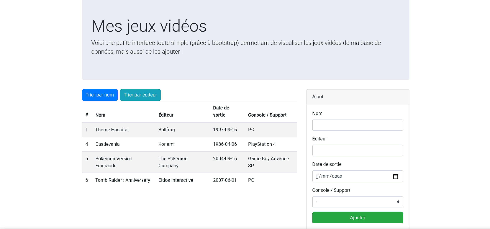

# Interface de gestion de jeux vidéo

Je souhaite gérer moi-même mon nombre insolent de jeux vidéo en ma possession, et ce, depuis mon premier Tetris sur GameBoy.
Du coup, petit projet fait avec PHP et Bootstrap.
Je peuc ajouter des jeux avec différents champs à remplir obligatoires et ils sont listés. 
Je peux les trier par éditeur et par noms.

Capture d'écran :

